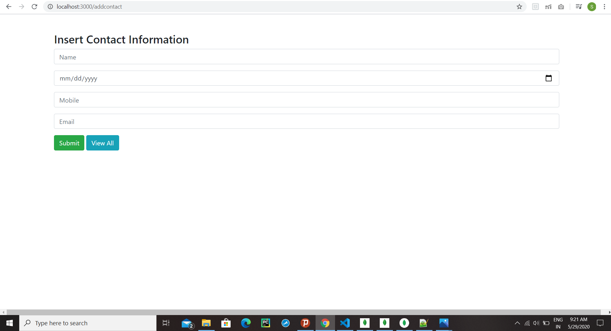

# phoneApp

#Architecture used: Model View Controller(MVC).
This assignment is done using Node.js.
Backend used: MongoDB

#Images
In this page we can insert new contact.

In this page we can update and delete the existing contacts. All the contacts are ordered in alphabetical order.

